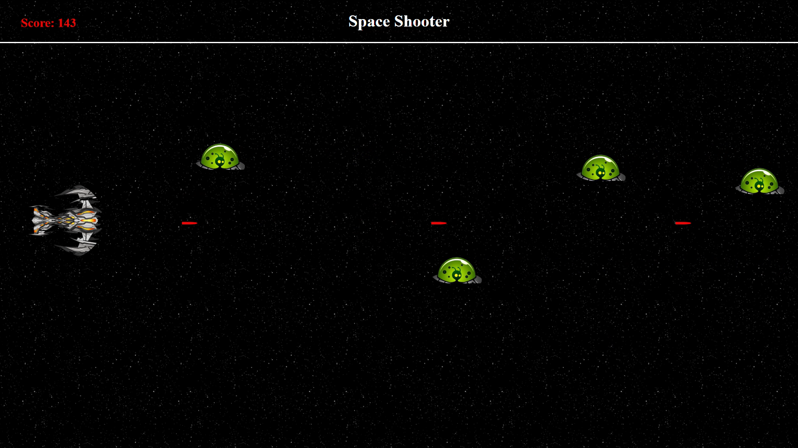

# Space Shooter Game

Welcome to the Space Shooter! This is an engaging game where players controls a spaceship and shoot enemy spaceships that appear from the right side of the screen.



## Game Overview

In this game, you control a spaceship that must shoot bullets on incoming enemy spaceships to earn points. The game ends when any of the enemy spaceships gets pass to the right side of screen. The objective is to score as many points as possible and stop enemy.

## Technologies Used

- **HTML**: For structuring the game interface.
- **CSS**: For styling and layout.
- **JavaScript**: For game logic and interactivity.

## Features

- Player-controlled spaceship
- Obstacles that appear randomly
- Scoring system based on obstacles hit
- Lives counter to track remaining lives
- Simple and responsive gameplay

## Getting Started

Click this link to play online: 
https://meet-official.github.io/SpaceShooter/

To run the Space Shooter game locally, follow these steps:

1. **Clone the repository**:
   ```bash
   git clone <https://github.com/Meet-official/SpaceShooter.git>
   ```

2. **Open the `index.html` file** in your web browser to start playing the game.

## How to Play

- Use the keys "W" and "S" to control the spaceship.
- Aim and shoot at the incoming obstacles.
- Keep track of your points and lives displayed on the screen.

## Contribution

Feel free to contribute to this project by adding new features or improving the existing code. Pull requests are welcome!

Enjoy playing the Space Shooter game! 🚀
